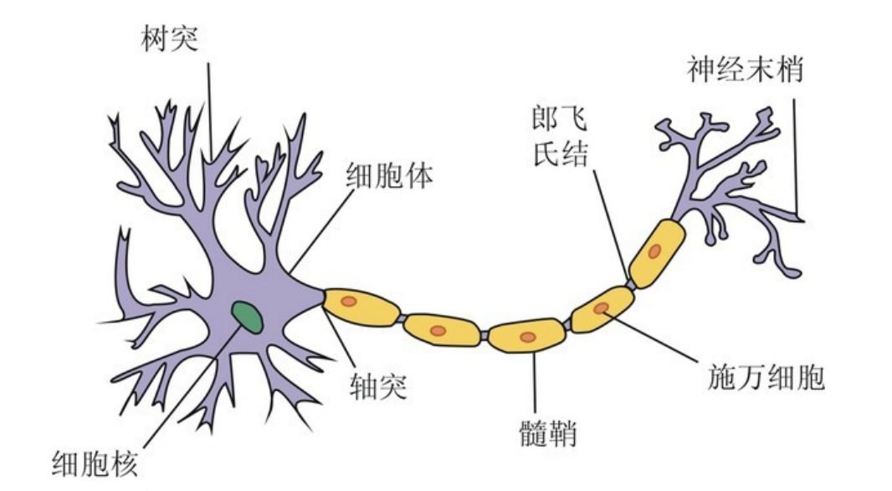
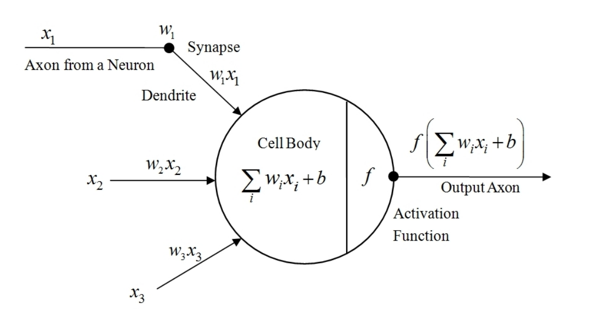
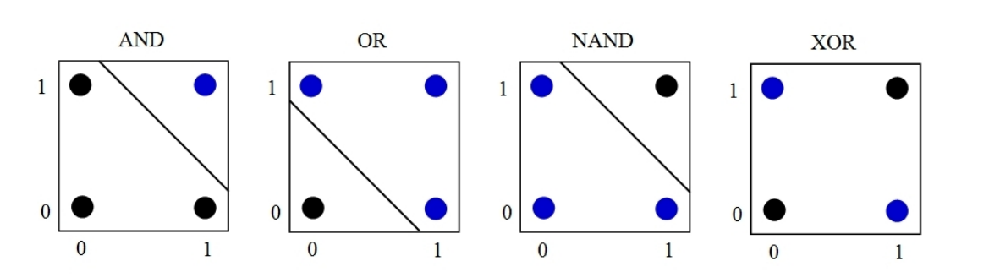
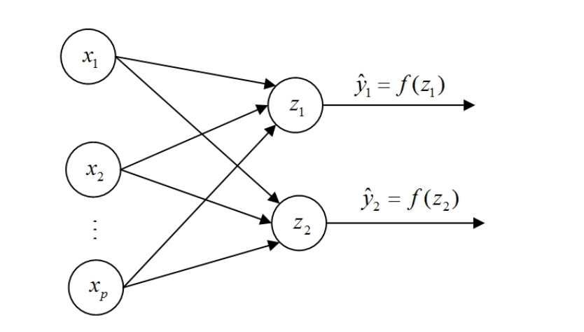
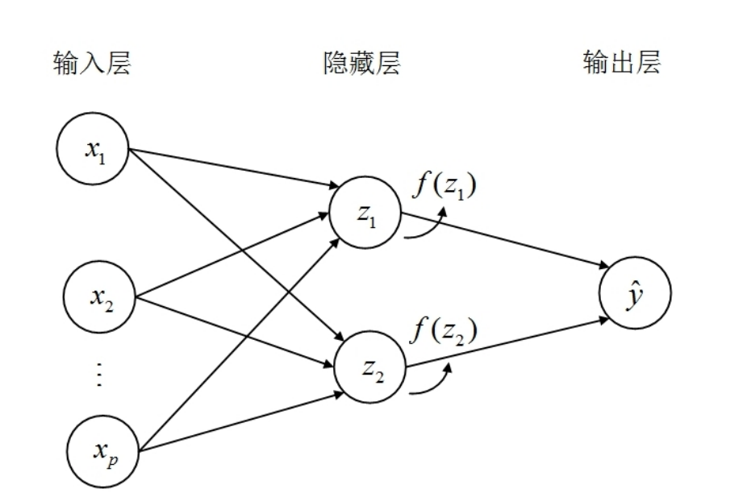
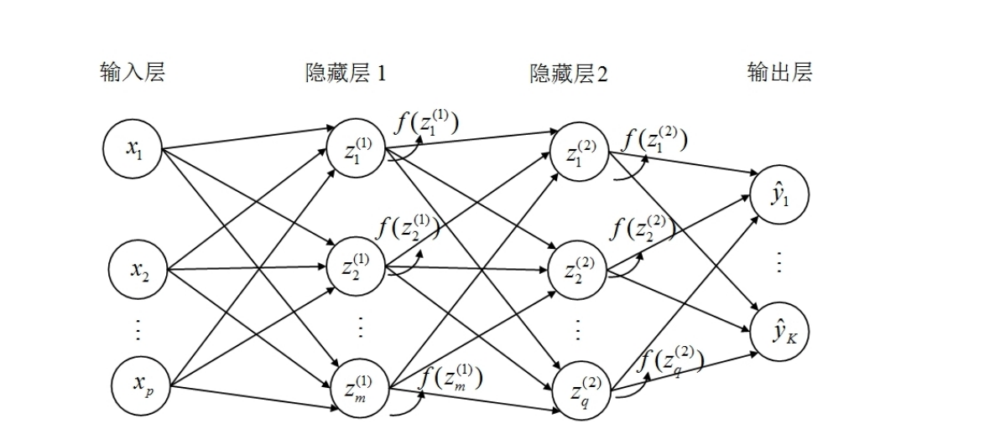
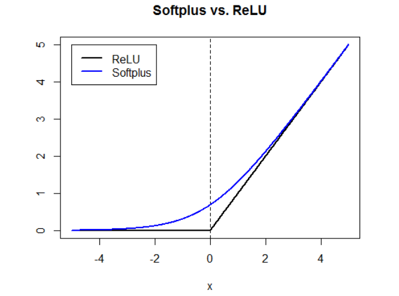
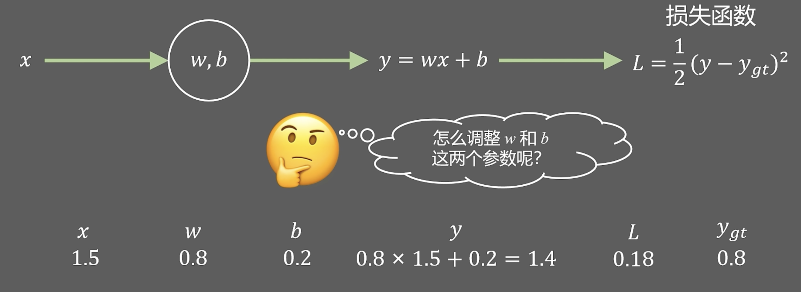

SVM的基本思想是：通过寻找最优的分离超平面，将两类数据分离开

SVM特别适用于变量很多的数据，因为在高维空间，数据被打散，更容易使用超平面进行分离。

SVM在变量较多的数据中有很多成功的应用，比如文本分析与图像识别。SVM曾在手写数字识别的MNIST数据集取得巨大成功。

### 分离超平面

在二维空间：

如果在三维空间，则可由一个平面分离。

更一般地，推广到高维空间，则可由一个“超平面”(hyperplane)分离，称为分离超平面。

假设有 $p$ 个特征变量，则分离超平面 $L$ 的方程可写为

$$
\beta_0 + \beta_1 x_1 + \cdots + \beta_p x_p = \beta_0 + \boldsymbol{\beta}' \mathbf{x} = 0
$$

此分离超平面 $L$ 将 $p$ 味特征空间一分为二

如果 $\beta_0 + \boldsymbol{\beta}' \mathbf{x} > 0$，则观测值 $\mathbf{x}$ 落于超平面 $L$ 的一边。  

反之，如果 $\beta_0 + \boldsymbol{\beta}' \mathbf{x} < 0$，则观测值$\mathbf{x}$ 落于超平面 $L$ 的另一边。  

$\vert \beta_0 + \boldsymbol{\beta}' \mathbf{x} \vert$的大小可用于度量观测值$\mathbf{x}$到超平面$L$的距离远近。  

如果两类数据之间存在分离超平面，则称数据为 “线性可分” (linearly separable)。

在线性可分的情况下，分离超平面一般并不唯一，因为总可以稍微移动超平面，而依然将两类数据分离，这里就要考虑最大间隔分类器。

### 最大间隔分类器

针对分类超平面不唯一问题，一种解决方法是使分离超平面离两类数据尽量远。

希望在两类数据之间有一条隔离带，而且这条隔离带越宽越好。这就是最大间隔分类器：即在两类数据之间建一条最宽的街道。

对于训练数据 $\{\mathbf{x}_i, y_i\}_{i=1}^n$，考虑二分类问题。

记响应变量，即“类别标签”为 $y_i \in \{-1, 1\}$

其中，“$y_i = 1$”为一类数据（称为“正例”，图中的蓝点）。  

而“$y_i = -1$”为另一类数据(称为“反例”，图中的黑点)。

希望用超平面分离这两类数据，即找到一个函数 $f(X) = \beta_0+X'\beta$，弱 $f(X)>0$，则预测 $\hat y=1$；反之，若 $f(X)<$，预测 $\hat y = -1$

记分离超平面为 $L = \{x:f(X) = 0\}$，则超平面 $L$ 的方程为

$$
f(\mathbf{x}) \equiv \beta_0 + \boldsymbol{\beta}' \mathbf{x} = 0
$$

其中，$\beta$ 为垂直此超平面的法向量。

记法向量 $\beta$ 方向与超平面 $L$ 的交点为 $X_0$，则从观测值 $X_i$ 刀超平面 $L$ 的最短距离为:

$$
\begin{align*}
d(\mathbf{x}_i, L) &= \|\mathbf{x}_i - \mathbf{x}_0\| \cos\theta \quad \text{(向量夹角的余弦公式)} \\
&= \|\mathbf{x}_i - \mathbf{x}_0\| \cdot \frac{\boldsymbol{\beta}' (\mathbf{x}_i - \mathbf{x}_0)}{\|\mathbf{x}_i - \mathbf{x}_0\| \|\boldsymbol{\beta}\|} \quad \text{(消去}\|\mathbf{x}_i - \mathbf{x}_0\|) \\
&= \frac{\boldsymbol{\beta}' (\mathbf{x}_i - \mathbf{x}_0)}{\|\boldsymbol{\beta}\|} \quad \text{(乘积展开)} \\
&= \frac{\boldsymbol{\beta}' \mathbf{x}_i - \boldsymbol{\beta}' \mathbf{x}_0}{\|\boldsymbol{\beta}\|}
\end{align*}
$$

其中，由于 $-1 \leq \cos {\theta} \leq 1$，故距离 $d$ 可正可负，取决于 $X_i$ 在超平面的哪一侧，称为符号距离。

由于 $X_0$ 在超平面 $L$ 上，满足超平面的方程，故 $-\beta'X_0 =\beta_0$，代入上式可得：

$$
d(\mathbf{x}_i, L) = \frac{\beta_0 + \boldsymbol{\beta}' \mathbf{x}_i}{\|\boldsymbol{\beta}\|} = \frac{f(\mathbf{x}_i)}{\|\boldsymbol{\beta}\|}
$$

$f(X_i)$ 离0越远，则观测值 $X_i$ 离超平面 $L = \{X:f(X)=0\}$ 越远。

假设超平面 $L$ 可将两类数据完全分离，即所谓“分离超平面”。此时分离超平面就是决策边界，因此，分类规则为：

$$
\hat{y} = \text{sign}\left( \beta_0 + \boldsymbol{\beta}' \mathbf{x} \right)
$$

其中，$\text{sign}(\cdot)$为“符号函数” (sign function)，即  

$$
\text{sign}(z) =
\begin{cases}
1 & \text{if } z > 0 \\
-1 & \text{if } z \leq 0
\end{cases}
$$

外卖希望所有样本点到分离超平面 $L$ 的距离越远越好。

在所有样本点中，到分离超平面 $L$ 的最小距离的两倍，称为间隔。

回顾此图，有三个样本点落在间隔上，其中一个蓝点，两个黑点。

在此例中，这三个样本点完全决定了**最优分离超平面与最大间隔**的位置，故称为**支持向量**

称蓝色支持向量所处的间隔为**正间隔**，记为 $L^+$，称黑色支持向量所处的间隔为**负间隔**，记为 $L^-$

由于 $f(X) = \beta_0 +\beta'X$ 为线性函数，故可通过线性变换，使得对于所有在**正间隔** $L^+$ 上的样本点，都有 $f(X_i) = 1$；而对于所有在**负间隔** $L^-$ 上的样本点，都有 $f(X_i) = -1$（这里只对正间隔和负间隔作用）

这里的线性变换具体指的是：

- 原始的线性函数 $f(\mathbf{x})$ 输出可以是任意实数（例如可能是 2、5、-3 等）  

- 通过线性变换（即对系数 $\beta_0$ 和 $\boldsymbol{\beta}$ 同时乘以一个非零常数），可以将正间隔边界 $L^+$ 上的函数值统一变为 1，负间隔边界 $L^-$ 上的函数值统一变为 -1  

考虑正间隔$L^+$上的某样本点$\mathbf{x}^*$，则$\mathbf{x}^*$到分离超平面$L$的距离之两倍，即为正间隔$L^+$与负间隔$L^-$之间的“最大间隔” (maximal margin)：  

$$
2d(\mathbf{x}^*, L) = 2\frac{f(\mathbf{x}^*)}{\|\boldsymbol{\beta}\|} = \frac{2}{\|\boldsymbol{\beta}\|}
$$  

其中，$f(\mathbf{x}^*) = 1$，因为 $\mathbf{x}^*$ 位于正间隔 $L^+$ 上。  

上式为最大化的目标函数，而约束条件是所有样本点都能正确分类。

在完全正确分类的情况下，对于所有 $y_i = 1$ 的正样例，都有 $f_(X_i) \geq 1$，故 $y_if(X_i) \geq 1$

反之，对于所有 $y_i = -1$ 的负样例，都有 $f(X_i) \leq -1$，故依然有 $y_if(X_i) \geq 1$.

无论正负样例，约束条件都是 $y_if(X_i) \geq 1$。

求解最大间隔的超平面的约束条件极值问题为

$$
\begin{align*}
&\max_{\boldsymbol{\beta}, \beta_0} \frac{2}{\|\boldsymbol{\beta}\|} \\
&\text{s.t. } y_i f(\mathbf{x}_i) \geq 1,\ i = 1, \cdots, n
\end{align*}
$$

根据此问题所得的分类器，称为**最大间隔分类器**

在训练集中的间隔越大，则我们期待在测试集中的间隔越越大，由此带来更好的泛化能力。

最大化$\dfrac{2}{\|\boldsymbol{\beta}\|}$等价于最小化$\|\boldsymbol{\beta}\|$，而后者又等价于最小化$\dfrac{1}{2}\|\boldsymbol{\beta}\|^2 = \dfrac{1}{2}\boldsymbol{\beta}'\boldsymbol{\beta}$。  

将“$f(\mathbf{x}_i) = \beta_0 + \boldsymbol{\beta}' \mathbf{x}_i$”代入约束条件，则最优化问题可写为  

$$
\begin{align*}
&\min_{\boldsymbol{\beta}, \beta_0} \frac{1}{2} \boldsymbol{\beta}' \boldsymbol{\beta} \\
&\text{s.t. } y_i \left( \beta_0 + \boldsymbol{\beta}' \mathbf{x}_i \right) \geq 1,\ i = 1, \cdots, n
\end{align*}
$$

由于目标函数 $\dfrac{1}{2}\boldsymbol{\beta}'\boldsymbol{\beta} = \dfrac{1}{2}(\beta_1^2 + \cdots + \beta_p^2)$ 为二次型，而约束条件 $y_i(\beta_0 + \boldsymbol{\beta}'\mathbf{x}_i) \geq 1$ 为线性不等式约束，故为“凸二次规划” (convex quadratic programming)问题。  

为求解此问题，引入“原问题”(primal problem)的拉格朗日乘子函数 $L_P$：

$$
\begin{align*}
\min_{\boldsymbol{\beta}, \beta_0, \boldsymbol{\alpha}} L_P(\boldsymbol{\beta}, \beta_0, \boldsymbol{\alpha})
&= \frac{1}{2} \boldsymbol{\beta}' \boldsymbol{\beta} - \sum_{i=1}^n \alpha_i \left[ y_i \left( \beta_0 + \boldsymbol{\beta}' \mathbf{x}_i \right) - 1 \right] \quad \text{(乘积展开)} \\
&= \frac{1}{2} \boldsymbol{\beta}' \boldsymbol{\beta} - \beta_0 \sum_{i=1}^n \alpha_i y_i - \boldsymbol{\beta}' \sum_{i=1}^n \alpha_i y_i \mathbf{x}_i + \sum_{i=1}^n \alpha_i
\end{align*}
$$

其中，$\boldsymbol{\alpha} \equiv (\alpha_1 \cdots \alpha_n)'$ 为对应于约束条件 $y_i(\beta_0 + \boldsymbol{\beta}' \mathbf{x}_i) \geq 1$ 的 $n$ 个拉格朗日乘子。  

使用向量微分规则，将拉格朗日函数分别对 $(\boldsymbol{\beta}, \beta_0)$ 求偏导数可得一阶条件：

$$
\begin{align*}
\frac{\partial L_P}{\partial \boldsymbol{\beta}} &= \boldsymbol{\beta} - \sum_{i=1}^n \alpha_i y_i \mathbf{x}_i = 0 \implies \boldsymbol{\beta} = \sum_{i=1}^n \alpha_i y_i \mathbf{x}_i \\
\frac{\partial L_P}{\partial \beta_0} &= -\sum_{i=1}^n \alpha_i y_i = 0 \implies \sum_{i=1}^n \alpha_i y_i = 0
\end{align*}
$$

由方程可知，最优 $\beta$ 为各样本点数据的线性组合。

由于原问题包含不等式约束，故最优解还需满足以下条件：

$$
\begin{cases}
\alpha_i \geq 0; \\
y_i \left( \beta_0 + \boldsymbol{\beta}' \mathbf{x}_i \right) \geq 1; \\
\alpha_i \left[ y_i \left( \beta_0 + \boldsymbol{\beta}' \mathbf{x}_i \right) - 1 \right] = 0
\end{cases}
$$  

其中，$i = 1, \cdots, n$。

第三个方程由支持向量决定。由于最优化问题是针对支持向量的

- 如果 $\alpha_i > 0$（乘子“激活” ），则必须满足 $y_i(\beta_0 + \boldsymbol{\beta}' \mathbf{x}_i) - 1 = 0$，即样本点恰好落在间隔边界上（是“支持向量” ）。  

- 如果 $y_i(\beta_0 + \boldsymbol{\beta}' \mathbf{x}_i) - 1 > 0$（样本点在间隔边界外侧，约束是“松弛”的 ），则必须有 $\alpha_i = 0$（乘子“未激活” ）。  

从 KKT 条件的第 3 个方程可知，要么 $\alpha_i = 0$，要么 $y_i \left( \beta_0 + \boldsymbol{\beta}' \mathbf{x}_i \right) = 1$。

如果$\alpha_i = 0$，则$y_i(\beta_0 + \boldsymbol{\beta}' \mathbf{x}_i) > 1$，说明观测值$\mathbf{x}_i$在间隔之外；而且，观测值$\mathbf{x}_i$**不影响**拉格朗日函数(因为$\alpha_i = 0$)。  

反之，如果$\alpha_i > 0$，则$y_i(\beta_0 + \boldsymbol{\beta}' \mathbf{x}_i) = 1$，说明观测值$\mathbf{x}_i$正好在间隔之上，即所谓“支持向量” (support vectors)；而且，支持向量**会影响**拉格朗日函数的最优化(因为$\alpha_i > 0$)。

注意：这里的 $\beta_0 + \boldsymbol{\beta}' \mathbf{x}_i$ 是优化过后的值，正样本等于1，负样本等于负一。

在估计完模型后，大部分的训练数据都无须保留，最终模型只与支持向量有关。但究竟哪些样本点是支持向量，则依然取决于全部数据。

于是可得到一个最大化的对偶问题 $L_D$

$$
\begin{align*}
\max_{\boldsymbol{\alpha}} L_D
&= \frac{1}{2} \underbrace{\left( \sum_{i=1}^n \alpha_i y_i \mathbf{x}_i \right)'}_{\hat{\boldsymbol{\beta}}'} \underbrace{\left( \sum_{i=1}^n \alpha_i y_i \mathbf{x}_i \right)}_{\hat{\boldsymbol{\beta}}} - \beta_0 \underbrace{\sum_{i=1}^n \alpha_i y_i}_{=0} \\
&\quad\quad - \underbrace{\left( \sum_{i=1}^n \alpha_i y_i \mathbf{x}_i \right)'}_{\hat{\boldsymbol{\beta}}'} \underbrace{\left( \sum_{i=1}^n \alpha_i y_i \mathbf{x}_i \right)}_{\hat{\boldsymbol{\beta}}} + \sum_{i=1}^n \alpha_i \\
&= \sum_{i=1}^n \alpha_i - \frac{1}{2} \left( \sum_{i=1}^n \alpha_i y_i \mathbf{x}_i \right)' \left( \sum_{i=1}^n \alpha_i y_i \mathbf{x}_i \right) \quad \text{(合并同类项)} \\
&= \sum_{i=1}^n \alpha_i - \frac{1}{2} \left( \sum_{i=1}^n \alpha_i y_i \mathbf{x}_i' \right) \left( \sum_{j=1}^n \alpha_j y_j \mathbf{x}_j \right) \quad \text{(转置、最后一项下标 } i \text{ 改为 } j\text{)} \\
&= \sum_{i=1}^n \alpha_i - \frac{1}{2} \sum_{i=1}^n \sum_{j=1}^n \alpha_i \alpha_j y_i y_j \mathbf{x}_i' \mathbf{x}_j \quad \text{(乘积展开)} \\
&= \sum_{i=1}^n \alpha_i - \frac{1}{2} \sum_{i=1}^n \sum_{j=1}^n \alpha_i \alpha_j y_i y_j \langle \mathbf{x}_i, \mathbf{x}_j \rangle
\end{align*}
$$

其中，$\mathbf{x}_i' \mathbf{x}_j$ 为 $\mathbf{x}_i$ 与 $\mathbf{x}_j$ 的内积，可记为 $\langle \mathbf{x}_i, \mathbf{x}_j \rangle$。

特征向量 $\{X_i\}_{i=1}^n$ 仅通过相互之间内积的方式影响最优解。

最大化问题是关于拉格朗日乘子 $\alpha$ 的二次型规划问题。

求解此对偶问题，并将所得解 $\hat{\boldsymbol{\alpha}} = (\hat{\alpha}_1 \cdots \hat{\alpha}_n)'$，代回最优 $\boldsymbol{\beta}$ 的表达式可得，$\hat{\boldsymbol{\beta}} = \sum_{i=1}^n \hat{\alpha}_i y_i \mathbf{x}_i$。  

对于截距项 $\beta_0$，可通过支持向量来求解。  

假设 $(\mathbf{x}_s, y_s)$ 为任意支持向量，则该支持向量在间隔上，故满足  

$$
y_s \left( \beta_0 + \boldsymbol{\beta}' \mathbf{x}_s \right) = 1
$$

在上式中，代入 $\hat{\boldsymbol{\beta}}$，即可求得 $\hat{\beta}_0$：  

$$
\hat{\beta}_0 = \frac{1}{y_s} - \hat{\boldsymbol{\beta}}' \mathbf{x}_s
$$  

此式对所有支持向量均成立。更稳健的作法是，针对原方程，对所有支持向量进行平均：

$$
\hat{\beta}_0 = \frac{1}{|S|} \sum_{s \in S} \left( \frac{1}{y_s} - \hat{\boldsymbol{\beta}}' \mathbf{x}_s \right)
$$  

其中，$S = \{ s \mid \alpha_s > 0 \}$ 为所有支持向量的下标集，而 $|S|$ 为支持向量的个数。

由此可得最优分离超平面的估计方程为  

$$
\hat{f}(\mathbf{x}) = \hat{\beta}_0 + \hat{\boldsymbol{\beta}}' \mathbf{x} = \hat{\beta}_0 + \left( \sum_{i=1}^n \hat{\alpha}_i y_i \mathbf{x}_i \right) \mathbf{x}
$$  

然后，可用 $\text{sign}\big( \hat{f}(\mathbf{x}) \big) = \text{sign}\big( \hat{\beta}_0 + \hat{\boldsymbol{\beta}}' \mathbf{x} \big)$ 进行分类预测。

### 软间隔分类器

并非所有数据都是线性可分的。如下图：

对于线性不可分的数据，可放松对于约束条件的要求，即只要求分离超平面将大多数观测值正确分离，而允许少量错误分类(或落入间隔之内)的观测值。

引入“松弛变量”(slack variable) $\xi_i \geq 0$，而将约束条件变为 $y_i \left( \beta_0 + \boldsymbol{\beta}' \mathbf{x}_i \right) \geq 1 - \xi_i$；但对所有观测值的松弛变量之和 $\sum_{i=1}^n \xi_i$ 进行惩罚。

此最小化问题可写为：

$$
\begin{align*}
\min_{\boldsymbol{\beta}, \beta_0, \xi_i} &\ \frac{1}{2} \boldsymbol{\beta}' \boldsymbol{\beta} + C \sum_{i=1}^n \xi_i \\
\text{s.t.} &\ y_i \left( \beta_0 + \boldsymbol{\beta}' \mathbf{x}_i \right) \geq 1 - \xi_i,\ \xi_i \geq 0,\ \forall i
\end{align*}
$$

其中，$C\geq 0$ 为调节变量，用来惩罚过大的松弛变量总和。

由于存在松弛变量 $\xi_i \geq 0$，故允许 $X_i$ 落在间隔错误的一遍，甚至分离超平面的错误一边，因此称为软间隔分类器，或支持向量分类器。

如果 $0<\xi_i<1$，则 $X_i$ 落在间隔的错误一边，但依然在超平面正确一遍。

如果 $\xi_i=1$，则 $X_i$ 正好落在超平面。

如果 $\xi_i >1$，则 $X_i$ 落在分离超平面的错误一边。

对于软间隔分类器，所有在**间隔上、间隔内与分类错误**的样本点，**都是支持向量**，因为它们都对最优解有影响。

如果惩罚参数 $C$ 为无穷大，则意味着算法不容忍训练样本中的任何分类错误。

这是因为目标函数是 $\dfrac{1}{2} \boldsymbol{\beta}' \boldsymbol{\beta} + C \sum_{i=1}^n \xi_i$ 。要最小化这个目标，因为 $C$ 无穷大，为了让整体尽可能小，必须让 $\sum_{i=1}^n \xi_i \to 0$（否则目标函数值会因 $C$ 放大而无穷大 ）。  这就是上节的最大间隔分类器，也称为硬间隔分裂器。

即使对于线性可分的数据，硬间隔分类器也可能不稳健，容易受到**极端值**(outlier)的影响。

在上图中，最上方的黑点为极端值。此极端值对于分离超平面的位置有很大影响，而且导致最大间隔非常狭窄。

此极端值很可能为**噪音**，而硬间隔分类器很好地拟合了噪音，导致过拟合，使得模型泛化能力下降。

即使对于线性可分的数据，一般也使用软间隔分类器，并将惩罚力度 $C$ 视为调节参数，通过交叉验证来确定其最优值。

对于软间隔分类器的求解，依然可使用拉格朗日函数，但须引入松弛变量 $\xi_i$ 和拉格朗日乘子 $\mu_i$

$$
\begin{align*}
\min_{\boldsymbol{\beta}, \beta_0, \boldsymbol{\alpha}, \boldsymbol{\mu}} &\ L_P(\boldsymbol{\beta}, \beta_0, \boldsymbol{\alpha}, \boldsymbol{\mu}) \\
&= \frac{1}{2} \boldsymbol{\beta}' \boldsymbol{\beta} + C \sum_{i=1}^n \xi_i - \sum_{i=1}^n \alpha_i \left[ y_i \left( \beta_0 + \boldsymbol{\beta}' \mathbf{x}_i \right) - 1 + \xi_i \right] - \sum_{i=1}^n \mu_i \xi_i
\end{align*}
$$

此问题的求解方法与最优解的形式，均类似于硬间隔分类器。

### 软间隔分类器的统计解释

在使用软间隔分类器时，最简单的一种优化方法为，仅惩罚分类错误的观测值个数。

如果 “$y_i f(\mathbf{x}_i) < 0$”，则分类错误。故目标函数可写为  

$$
\min_{\boldsymbol{\beta}, \beta_0} \frac{1}{2} \boldsymbol{\beta}' \boldsymbol{\beta} + C \sum_{i=1}^n I \big( y_i \left( \beta_0 + \boldsymbol{\beta}' \mathbf{x}_i \right) < 0 \big)
$$  

其中，$C > 0$ 为调节变量，控制对分类错误的惩罚力度；$I(\cdot)$ 为示性函数。  

定义裕度(margin) $z_i \equiv y_i (\beta_0 + \boldsymbol{\beta}' \mathbf{x}_i)$，则上式可通过 0-1 损失函数来表达：

$$
\min_{\boldsymbol{\beta}, \beta_0} \frac{1}{2} \boldsymbol{\beta}' \boldsymbol{\beta} + C \sum_{i=1}^n \ell_{0/1}(z_i)
$$

其中，$\ell_{0/1}(z_i)$ 为 0-1 损失函数，是裕度 $z_i$ 的函数，其定义为

$$
\ell_{0/1}(z_i) =
\begin{cases}
0 & \text{if } z_i \geq 0 \\
1 & \text{if } z_i < 0
\end{cases}
$$

其中，如果裕度 $z_i$ 非负，则损失为 0；而如果裕度 $z_i$ 为负，则损失为 1。

但 0-1 损失函数既不连续，也非凸函数，故不易进行最优化。

一般使用其他函数来替代 0-1 损失函数，称为替代损失函数。

这里的 $z_i$ 裕度是指的点到超平面的标准化距离。

可以证明，它支持向量机使用的替代损失函数为如下合页损失函数。

$$
\ell_{\text{hinge}}(z_i) =
\begin{cases}
0 & \text{if } z_i \geq 1 \\
1 - z_i & \text{if } z_i < 1
\end{cases}
$$

如果裕度 $z_i \geq 1$，则损失为0（不惩罚）；反之，如果 $z_i <1$，则其损失为 $1-z_i$

SVM 追求 *“最大间隔”* ，希望样本在正确分类的基础上，尽可能远离分类边界。把阈值设为 1 ，是为了构造 *“间隔约束”* ：  

- 当 $z_i \geq 1$ 时，说明样本不仅被正确分类（因 $z_i = y_i(\cdot) \geq 0$ 已保证分类正确 ），还处于 *“安全距离”*（间隔 ≥1 ），所以损失为 0 ，不惩罚。  

- 当 $z_i < 1$ 时，样本虽然分类正确（若 $z_i \geq 0$ ）或错误（ $z_i < 0$ ），但没达到 *“安全间隔 1”*，需要惩罚，惩罚项 $1 - z_i$ 会随着 $z_i$ 减小而增大，督促模型把样本推到间隔外。

这也是为什么要将阈值定为1。

由于此函数的形状类似于门框的合页，故称为“合页损失函数”。

可将分段函数 $\ell_{\text{hinge}}(z_i) =
\begin{cases}
0 & \text{if } z_i \geq 1 \\
1 - z_i & \text{if } z_i < 1
\end{cases}$ 写成统一的表达式：

$$
\ell_{\text{hinge}}(z_i) = \max(0, 1 - z_i)
$$

将合页损失函数代入目标函数。并记松弛变量 $\xi_i = 1-z_i$，可得

$$
\begin{align*}
\min_{\boldsymbol{\beta}, \beta_0} &\ \frac{1}{2} \boldsymbol{\beta}' \boldsymbol{\beta} + C \sum_{i=1}^n \ell_{\text{hinge}}(z_i) \\
&= \frac{1}{2} \boldsymbol{\beta}' \boldsymbol{\beta} + C \sum_{i=1}^n \max(0, 1 - z_i) \\
&= \frac{1}{2} \boldsymbol{\beta}' \boldsymbol{\beta} + C \sum_{i=1}^n (1 - z_i) I(1 - z_i \geq 0) \\
&= \frac{1}{2} \boldsymbol{\beta}' \boldsymbol{\beta} + C \sum_{i=1}^n \xi_i I(\xi_i \geq 0)
\end{align*}
$$

尽管合页损失函数依然不光滑，但至少是连续的凸函数，其数学性质优于 0-1损失函数。

光滑的替代损失函数则包括指数损失函数，以及逻辑损失函数。支持向量机的合页损失函数与逻辑回归的逻辑损失函数最为接近。

### 支持向量机

在数据线性不可分的情况下，一般存在非线性的决策边界。

在上图中，不存在任何线性的分离超平面，但存在一个近乎圆形的决策边界。

可以做一个极坐标变换，将特征向量 $(x_1，x_2)$ 变换为 $(r,\theta)$：

$$
\begin{cases}
x_1 - \overline{x}_1 = r \cos\theta \\
x_2 - \overline{x}_2 = r \sin\theta
\end{cases}
$$

其中，$\bar{x}_1$ 与 $\bar{x}_2$ 分别为 $x_1$ 与 $x_2$ 的样本均值；而半径 $r = \sqrt{(x_1 - \bar{x}_1)^2 + (x_2 - \bar{x}_2)^2}$ 。

在变换后的 $(r,\theta)$ 特征空间，两类数据均为线性可分。

蓝色数据的班级显然更大，而黑色数据的半径更小，故只要选择如 $r\geq t$ 的超平面即可进行分离。

更一般的，对于决策边界非线性的数据，考虑对特征向量 $X_i$ 进行变换，比如将 $X_i$ 变换为 $\varphi(X_i)$，其中，$\varphi(X_i)$ 为多维函数（唯独可以高于 $X_i$），甚至无限维函数。

这意味着，将训练样本 $\{\mathbf{x}_i, y_i\}_{i = 1}^n$ 变换为 $\{\boldsymbol{\varphi}(\mathbf{x}_i), y_i\}_{i = 1}^n$ 。

目的是希望在 $\varphi(X_i)$ 的特征空间中，可以得到线性可分的情形。

但难点在于，对于高维数据，一般不知道变换 $\boldsymbol{\varphi}(\cdot)$ 的具体形式。

**例** 在桌上叠放一张黑纸与白纸。黑纸上的黑点属于一类，而白纸上的白点属于另一类。显然，这两类点可用超平面分离。现将这两张纸揉成一团，则无法再用超平面分离黑点与白点。然而，若将这两张纸再摊平捋顺（特征变换 $\boldsymbol{\varphi}(\cdot)$ ），则又可用超平面分离黑点与白点。

根据上述推导，支持向量机的估计结果仅依赖于 $\left\langle \boldsymbol{\varphi}(\mathbf{x}_i), \boldsymbol{\varphi}(\mathbf{x}_j) \right\rangle$，即 $\boldsymbol{\varphi}(\mathbf{x}_i)$ 与 $\boldsymbol{\varphi}(\mathbf{x}_j)$ 的内积，而不必知道 $\boldsymbol{\varphi}(\cdot)$ 。

为此，将此内积定义为如下**核函数**

$$
\kappa(\mathbf{x}_i, \mathbf{x}_j) \equiv \left\langle \boldsymbol{\varphi}(\mathbf{x}_i), \boldsymbol{\varphi}(\mathbf{x}_j) \right\rangle = \boldsymbol{\varphi}(\mathbf{x}_i)' \boldsymbol{\varphi}(\mathbf{x}_j)
$$

只要直接指定核函数 $\kappa(\mathbf{x}_i, \mathbf{x}_j)$ 的具体形式即可；而无须预先知道 $\boldsymbol{\varphi}(\cdot)$，再计算 $\left\langle \boldsymbol{\varphi}(\mathbf{x}_i), \boldsymbol{\varphi}(\mathbf{x}_j) \right\rangle$（此内积可能不易计算，尤其在高维空间中）。这种方法称为**核技巧**

$\kappa(\mathbf{x}_i, \mathbf{x}_j)$ 必须关于 $\mathbf{x}_i$ 与 $\mathbf{x}_j$ 是对称的，即 $\kappa(\mathbf{x}_i, \mathbf{x}_j) = \kappa(\mathbf{x}_j, \mathbf{x}_i)$。  

常用的核函数包括：  

(1) 多项式核(polynomial kernel)：  

$$
\kappa(\mathbf{x}_i, \mathbf{x}_j) = (1 + \gamma \mathbf{x}_i' \mathbf{x}_j)^d
$$  

其中，$d \geq 1$ 为多项式的次数，而 $\gamma > 0$ 为参数。如果 $d = 1$，则为 “线性核函数” (linear kernel)，即不作变换，可直接令 $\kappa(\mathbf{x}_i, \mathbf{x}_j) = \mathbf{x}_i' \mathbf{x}_j$。

(2) 径向核(radial kernel)，也称为“径向基函数”(Radial Basis Function，简记 RBF)：  

$$
\kappa(\mathbf{x}_i, \mathbf{x}_j) = \exp\left(-\gamma \|\mathbf{x}_i - \mathbf{x}_j\|^2\right), \quad \gamma > 0
$$  

其中，$\|\cdot\|$ 为 2-范数（即欧氏距离）；$\gamma > 0$ 为径向核的参数。径向核非常接近正态分布的密度函数，故也称为“高斯核”(Gaussian kernel)。  

(3) 拉普拉斯核(Laplacian kernel)：  

$$
\kappa(\mathbf{x}_i, \mathbf{x}_j) = \exp\left(-\gamma \|\mathbf{x}_i - \mathbf{x}_j\|\right), \quad \gamma > 0
$$  

拉普拉斯核类似于径向核，但在指数 $\exp(\cdot)$ 中直接使用欧氏距离。

(4) S 型核(Sigmoid kernel)：  

$$
\kappa(\mathbf{x}_i, \mathbf{x}_j) = \tanh\left( \beta \mathbf{x}_i' \mathbf{x}_j + \theta \right), \quad \beta > 0, \theta < 0
$$

其中，$\tanh(\cdot)$ 为 “双曲正切函数” (hyperbolic tangent)，定义为  

$$
\tanh(z) \equiv \frac{e^z - e^{-z}}{e^z + e^{-z}}
$$  

在神经网络中，双曲正切函数也作为 “激活函数” (activation function)

在最大间隔分类器最优解 $\hat f(X)$ 的表达式中，以变换后的 $\varphi(X)$ 替代 $X$ 可得

$$
\begin{align*}
\hat{f}(\mathbf{x}) &= \hat{\beta}_0 + \hat{\boldsymbol{\beta}}' \boldsymbol{\varphi}(\mathbf{x}) = \hat{\beta}_0 + \left( \sum_{i=1}^n \hat{\alpha}_i y_i \boldsymbol{\varphi}(\mathbf{x}_i) \right)' \boldsymbol{\varphi}(\mathbf{x}) \\
&= \hat{\beta}_0 + \left( \sum_{i=1}^n \hat{\alpha}_i y_i \boldsymbol{\varphi}(\mathbf{x}_i)' \boldsymbol{\varphi}(\mathbf{x}) \right) = \hat{\beta}_0 + \left( \sum_{i=1}^n \hat{\alpha}_i y_i \kappa(\mathbf{x}_i, \mathbf{x}) \right)
\end{align*}
$$

这意味着，支持向量机的最优解 $\hat f(X)$ 可通过训练样本的核函数 $\kappa(X_i,X)$ 展开，称为支持向量展开。

更一般的，核技巧的应用不局限于支持向量机，后来发展出一系列基于核函数的学习方法，统称为核方法。

### 多分类问题的支持向量机

由于支持向量机使用超平面分离不同类别的数据，故并没有推广到多分类问题的自然方法。

对于多分类问题，通常的解决方法为**1对1分类**，也称为**全配对法**

具体而言，假设数据共分为 $K$ 类，其中 $K>2$。

在这 $K$ 类数据中，取出两类，则可能的取法组合为

$$
\dbinom{K}{2} = C_K^2 = \frac{K(K - 1)}{2}
$$

对这 $\displaystyle C_K^2$ 个二分类问题均使用支持向量机，可得到 $\displaystyle C_K^2$ 个 SVM 模型。  

对于一个新的 “测试观测值” (test observation)，使用这 $\displaystyle C_K^2$ 个 SVM 模型进行预测，然后以最常见的预测类别作为最终的预测结果。  

事实上，这也是一种两两对决 (PK)，最终以多数票规则加总的方法。  

### 支持向量回归

支持向量机最初仅用于分类问题，但后来也推广到了回归问题，即所谓支持向量回归（SVR）

SVR的基本思想是，将支持向量机的合页损失函数移植到回归问题。

记回归函数(超平面)为 $f(\mathbf{x}) = \beta_0 + \mathbf{x}' \boldsymbol{\beta}$，并以此函数预测连续型响应变量 $y$。

SVR的目标函数为

$$
\min_{\boldsymbol{\beta}, \beta_0} \frac{1}{2} \boldsymbol{\beta}' \boldsymbol{\beta} + C \sum_{i=1}^n \ell_\varepsilon \left( y_i - f(\mathbf{x}_i) \right) \tag{14.36}
$$  

其中，$C > 0$ 为正则化参数(regularization parameter)，$z_i \equiv y_i - f(\mathbf{x}_i)$ 为残差(residual)；而 $\ell_\varepsilon (\cdot)$ 为 $\varepsilon$-不敏感损失函数($\varepsilon$-insensitive loss function)，其定义为  

$$
\ell_\varepsilon (z_i) =
\begin{cases}
0 & \text{if } |z_i| \leq \varepsilon \\
|z_i| - \varepsilon & \text{if } |z_i| > \varepsilon
\end{cases} \tag{14.37}
$$  

其中，$\varepsilon > 0$ 也是调节参数。

上式意味着，若残差 $z_i \equiv y_i - f(\mathbf{x}_i)$ 的绝对值小于或等于 $\varepsilon$，则损失为 0。  

在宽度为 $2\varepsilon$ 的间隔带中，损失函数对残差不敏感，故名“$\varepsilon$-不敏感损失函数”。  

反之，若残差 $z_i$ 的绝对值大于 $\varepsilon$，则损失为 $\vert z_i \vert - \varepsilon$，呈 1 对 1 的线性增长

与平方损失函数相比，$\varepsilon-$ 不敏感损失函数存在一个半径为 $\varepsilon$ 的不敏感带，其损失函数为0。出了此敏感带后，$\varepsilon-$ 不敏感损失函数呈线性增长，其增长速度不及平方损失的二次函数。

如果将 $\dfrac{1}{2} \boldsymbol{\beta}' \boldsymbol{\beta}$ 视为惩罚项，则 SVR 的目标函数类似于岭回归：  

$$
\min_{\boldsymbol{\beta}, \beta_0} \ C \sum_{i=1}^n \ell_\varepsilon \left( y_i - f(\mathbf{x}_i) \right) + \dfrac{1}{2} \boldsymbol{\beta}' \boldsymbol{\beta}
$$  

上式与岭回归的区别在于，岭回归以平方损失函数替代 $\varepsilon$-不敏感损失函数 $\ell_\varepsilon(\cdot)$ 。由于使用 $\varepsilon$-不敏感损失函数，这种支持向量回归也称为 $\varepsilon$-回归 ($\varepsilon$-regression)。

SVR由于使用了类似支持向量机的合页损失函数，故SVR比较适用于变量较多的数据。

SVR也可使用核技巧。

$\varepsilon-$ 不敏感损失函数为线性函数，故对于极端值不敏感，比较稳健。这些是使用支持向量回归的主要理由

### 支持向量机的优缺点

支持向量机的最大优点是，它比较适用于变量很多的数据。

当特征向量的维度 $p$ 很大时，数据被打散，使得散布于 $p$ 维空间的样本点比较容易使用超平面进行分离。

这使得 SVM在文本分析方面得到广泛应用，比如文件分类与情感分析。

由于语言中的词汇很多，故问分数据通常有很丰富的特征变量，在2012年之前，SVM在图像识别领域也是领先的算法；但在之后被卷积神经网络超越。

支持向量机的缺点则包括，有时它对于核函数中的参数比较敏感。

对于真正的高位数据，SVM可能表现较差。此时，特征空间的维度远超样本容量，故只有相对较少的支持向量来决定更高维度的分离超平面，这使得模型的泛化能力变差。

另外，由于SVM使用超平面进行分类，故无法从概率的角度解释：比如，无法算出观测值分类归属的后验概率。

### 案例