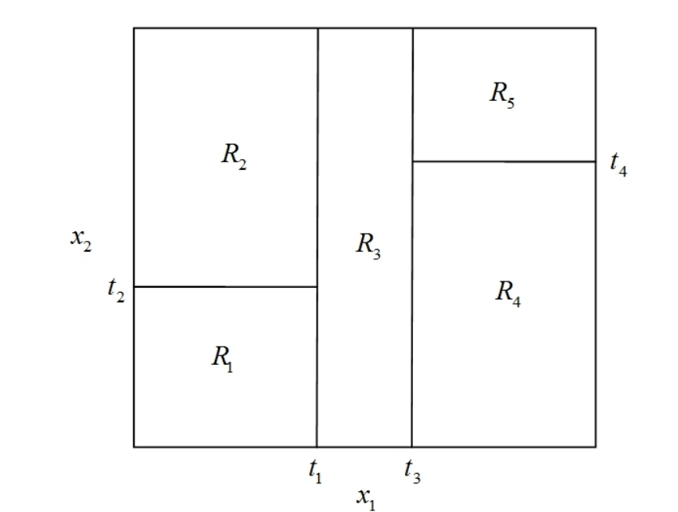
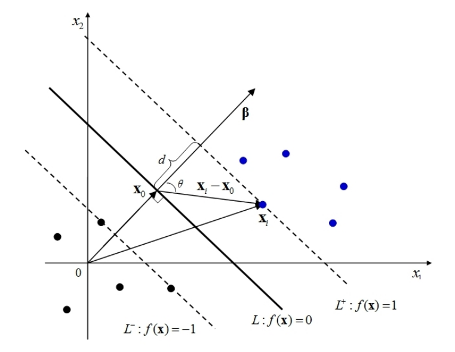
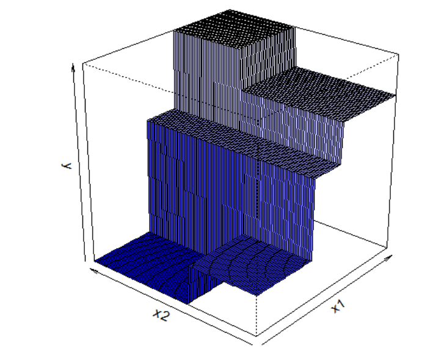

## 决策树

决策树本质上也是一种近邻方法，可视为“自适应近邻法”

决策树在进行节点分裂时考虑了 $y$ 的信息，故更有智慧，不受噪音变量的影响，且适用于高维数据。

如果将决策树用于分类问题，则称为“分类树”。
如果将决策树用于回归问题，则称为“回归树”。

### 分类树的启发案例

Breiman et al. (1984)研究了 UCSD 医学中心的一个案例。当心梗病人进入 UCSD 医学中心后 24 小时内，测量 19 个变量，包括血
压、年龄以及 17 个排序或虚拟变量。数据集中包含 215 个病人，其中 37
人为高危病人。

研究目的是为了快速预测哪些心梗病人为“高危病人”(High risk，记为H，无法活过30天)，而哪些是“低危病人” (Low risk，记为L，可活过30天)，从而更好地配置医疗资源。

Breiman et al. (1984)建立了如下分类树

在图中，首先从顶部的根节点(root node)出发，考察病人“收缩压是否低于或等于 91”。

如果答案为“是”，则向左，到达终节点(terminal node)或叶节点(leaf node)，
归类为 H(高危)；反之，则向右，到下一个内节点(internal node)。

此时，需回答的问题为“年龄是否小于或等于 62.5 岁”。如何答案为“是”，则向左，到达终节点，归类为 L(低危)；反之，则继续向右，到再下一个内节点。

此时，需回答的问题为“是否窦性心动过速”。如何答案为“是”，则向左，到达终节点，归类为 H(高危)；反之，则继续向右，到达终节点，归
类为 L(低危)。

在图中，终节点为方形，为决策树的最底端，不再分裂。

在分裂之前，所有样本点都在最顶端的根节点，而根节点与终节点之间的节点的节点均称为“内节点”。

建立分类树模型之后，要进行预测十分简单。只要将观测值从决策树放下(drop an observation down the tree)，回答一系列的是或否问题(是则向左，否即向右)，看它落入哪片叶节点。

然后使用“多票数规则”进行预测，即看落入该叶节点的训练数据最多为哪类。

由于决策树不对函数形式作任何假设，故比较稳健，其预测效果可能优于参数方法(比如判别分析、逻辑回归)。

在以上案例中，虽然数据集共有 19 个特征变量，但所估计的分类树只用到 3 个变量。

通过以上模型可清晰地知道高危与低危病人的类型：比如，模型所识别的高危病人可分为两种类型，即收缩压低于或等于 91 者(血压过低)；或收缩压虽高于 91，但年龄大于 62.5 岁，且窦性心动过速者。

### 二叉树的数学本质

上述案例所用的决策树为二叉树：每次总将“母节点”一分为二，分裂为两个“子节点”，直到达终节点。

二叉树将“特征空间”进行递归分割，每次总是沿着某个特征向量 $X_j$ 轴平行的方向进行切割，切成“矩形”、“超矩形”区域，即所谓“箱体”。

二叉树是通过分割特征空间进行分类的分类器：假设只有两个特征向量 $(x_1,x_2)$，则递归分裂的一种可能结果如下

首先根据是否 $x_1 \leq t_1$ 进行分裂。

然后根据是否 $x_2 \leq t_2$ 进行分割，得到终节点 $R_1$ 和 $R_2$。

接着，根据是否 $x_1 \leq t_3$ 进行分裂，得到终节点 $R_3$。

最后，根据是否 $x_2 \leq t_4$ 进行分割，得到终节点 $R_4 \leq R_5$。

对于三维以上的特征空间，无法使用类似于上图的方法来展示递推分割；但依然可用图中的树状结构来表示，因为决策树每次仅使用一个变量进行分割。

决策树模型将特征空间分割为若干个矩形终节点。

在进行预测时，每个终节点只有一个共同的预测值。

对于分类问题，次预测值为该终节点所有训练样本的最常见类别。

对于回归问题，测预测为该终节点所有训练样本的平均值。

在数学上，决策树为“分段场值函数”，这意味着估计的函数 $\hat f(X)$ 不是连续函数。

但这并不妨碍决策树成为一种灵活而有用的算法，特别是作为“基学习器”(base learner)广泛用于随机森林与提升法。

因为这些超矩形的维度太高，同时估计在计算上不可行。决策树采取了一种“自上而下”(top-down)，每次仅分裂一个变量的方法。这是一种“贪心算法”(greedy algorithm)，每次仅选择一个最优的分裂变量，而未通盘考虑全局的最优分区。

### 分类树的分裂准则

对于 CART 算法的二叉树，在每个节点进行分裂时，需要确定“分裂变量”进行分裂，以及在该变量的什么临界值进行分裂。

对于分类树，我们希望在节点分裂之后，其两个字节点内部的纯度最高。

关于决策树的纯度，在决策树算法中，纯度（Purity） 是衡量数据集中样本 "一致性" 的指标。直观地说，纯度越高，数据集中的样本越可能属于同一类别；纯度越低，则样本越混杂。决策树通过递归划分数据来提高纯度，从而构建分类或回归模型。

分裂之后数据的“不纯度”应下降最度。

假设响应变量 $y$ 共分 $K$ 类，取值为 $y \in {1,\dots , K}$ ，在节点 $t$，记不同 $y$ 的取值相应概率为 $p_1$ ,$\dots$ , $p_k$，其中 $p_k \geq 0$，且 $\sum _{k = 1}^K p_k = 1$。

作为分裂准则，希望定义一个节点不纯度函数 $\phi$