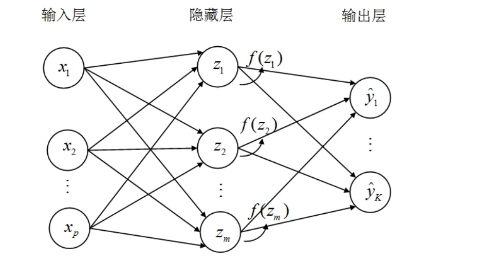
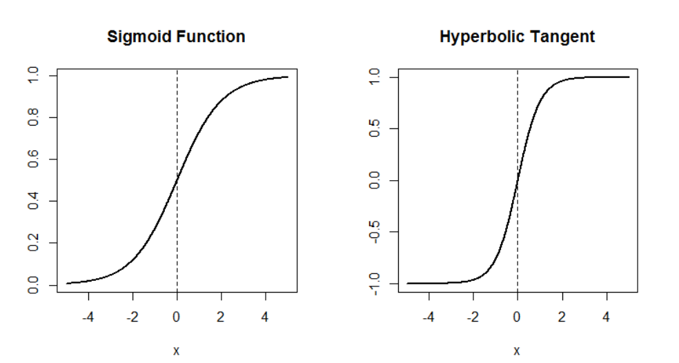

## 决策树

决策树本质上也是一种近邻方法，可视为“自适应近邻法”

决策树在进行节点分裂时考虑了 $y$ 的信息，故更有智慧，不受噪音变量的影响，且适用于高维数据。

如果将决策树用于分类问题，则称为“分类树”。
如果将决策树用于回归问题，则称为“回归树”。

### 分类树的启发案例

Breiman et al. (1984)研究了 UCSD 医学中心的一个案例。当心梗病人进入 UCSD 医学中心后 24 小时内，测量 19 个变量，包括血
压、年龄以及 17 个排序或虚拟变量。数据集中包含 215 个病人，其中 37
人为高危病人。

研究目的是为了快速预测哪些心梗病人为“高危病人”(High risk，记为H，无法活过30天)，而哪些是“低危病人” (Low risk，记为L，可活过30天)，从而更好地配置医疗资源。

Breiman et al. (1984)建立了如下分类树

在图中，首先从顶部的根节点(root node)出发，考察病人“收缩压是否低于或等于 91”。

如果答案为“是”，则向左，到达终节点(terminal node)或叶节点(leaf node)，
归类为 H(高危)；反之，则向右，到下一个内节点(internal node)。

此时，需回答的问题为“年龄是否小于或等于 62.5 岁”。如何答案为“是”，则向左，到达终节点，归类为 L(低危)；反之，则继续向右，到再下一个内节点。

此时，需回答的问题为“是否窦性心动过速”。如何答案为“是”，则向左，到达终节点，归类为 H(高危)；反之，则继续向右，到达终节点，归
类为 L(低危)。

在图中，终节点为方形，为决策树的最底端，不再分裂。

在分裂之前，所有样本点都在最顶端的根节点，而根节点与终节点之间的节点的节点均称为“内节点”。

建立分类树模型之后，要进行预测十分简单。只要将观测值从决策树放下(drop an observation down the tree)，回答一系列的是或否问题(是则向左，否即向右)，看它落入哪片叶节点。

然后使用“多票数规则”进行预测，即看落入该叶节点的训练数据最多为哪类。

由于决策树不对函数形式作任何假设，故比较稳健，其预测效果可能优于参数方法(比如判别分析、逻辑回归)。

在以上案例中，虽然数据集共有 19 个特征变量，但所估计的分类树只用到 3 个变量。

通过以上模型可清晰地知道高危与低危病人的类型：比如，模型所识别的高危病人可分为两种类型，即收缩压低于或等于 91 者(血压过低)；或收缩压虽高于 91，但年龄大于 62.5 岁，且窦性心动过速者。

### 二叉树的数学本质

上述案例所用的决策树为二叉树：每次总将“母节点”一分为二，分裂为两个“子节点”，直到达终节点。

二叉树将“特征空间”进行递归分割，每次总是沿着某个特征向量 $X_j$ 轴平行的方向进行切割，切成“矩形”、“超矩形”区域，即所谓“箱体”。

二叉树是通过分割特征空间进行分类的分类器：假设只有两个特征向量 $(x_1,x_2)$，则递归分裂的一种可能结果如下

首先根据是否 $x_1 \leq t_1$ 进行分裂。

然后根据是否 $x_2 \leq t_2$ 进行分割，得到终节点 $R_1$ 和 $R_2$。

接着，根据是否 $x_1 \leq t_3$ 进行分裂，得到终节点 $R_3$。

最后，根据是否 $x_2 \leq t_4$ 进行分割，得到终节点 $R_4 \leq R_5$。

对于三维以上的特征空间，无法使用类似于上图的方法来展示递推分割；但依然可用图中的树状结构来表示，因为决策树每次仅使用一个变量进行分割。

决策树模型将特征空间分割为若干个矩形终节点。

在进行预测时，每个终节点只有一个共同的预测值。

对于分类问题，次预测值为该终节点所有训练样本的最常见类别。

对于回归问题，测预测为该终节点所有训练样本的平均值。

在数学上，决策树为“分段场值函数”，这意味着估计的函数 $\hat f(X)$ 不是连续函数。

但这并不妨碍决策树成为一种灵活而有用的算法，特别是作为“基学习器”(base learner)广泛用于随机森林与提升法。

因为这些超矩形的维度太高，同时估计在计算上不可行。决策树采取了一种“自上而下”(top-down)，每次仅分裂一个变量的方法。这是一种“贪心算法”(greedy algorithm)，每次仅选择一个最优的分裂变量，而未通盘考虑全局的最优分区。

### 分类树的分裂准则

对于 CART 算法的二叉树，在每个节点进行分裂时，需要确定“分裂变量”进行分裂，以及在该变量的什么临界值进行分裂。

对于分类树，我们希望在节点分裂之后，其两个字节点内部的纯度最高。

关于决策树的纯度，在决策树算法中，纯度（Purity） 是衡量数据集中样本 "一致性" 的指标。直观地说，纯度越高，数据集中的样本越可能属于同一类别；纯度越低，则样本越混杂。决策树通过递归划分数据来提高纯度，从而构建分类或回归模型。

分裂之后数据的“不纯度”应下降最度。

假设响应变量 $y$ 共分 $K$ 类，取值为 $y \in {1,\dots , K}$ ，在节点 $t$，记不同 $y$ 的取值相应概率为 $p_1$ ,$\dots$ , $p_k$，其中 $p_k \geq 0$，且 $\sum _{k = 1}^K p_k = 1$。

作为分裂准则(splitting criterion)，希望定义一个节点不纯度函数(node impurity function）$\varphi(p_1,\cdots,p_K) \geq 0$。

该函数应具备以下性质：

(1) 当$p_1 = \cdots = p_K = \dfrac{1}{K}$时，不纯度最高，即$\varphi(p_1,\cdots,p_K)$达到最大值。

(2) 当且仅当$(p_1,p_2 \cdots,p_K) = (1,0,\cdots,0)$，$(0,1,\cdots,0)$，$\cdots$，或$(0,0,\cdots,1)$时，不纯度为 0，即$\varphi(p_1,\cdots,p_K)$达到最小值 0。

(3) $\varphi(p_1,\cdots,p_K)$关于自变量$(p_1,\cdots,p_K)$是对称的。

满足这些性质的函数并不唯一。一个自然的选择是使用错分率(misclassification rate)作为不纯度函数：

$$
\text{Err}(p_1,\cdots,p_K) \equiv 1 - \max\left\{p_1,\cdots,p_K\right\}
$$

其中， $\max \{ p_1,p_2,\dots ,p_K\}$ 为最多类别的发生频率，而 $1 - \max \{ p_1,p_2,\dots ,p_K\}$ 则为以最多类别预测时的错分率。

对于二分类问题，错分率简化为

$$
\text{Err}(p_1, p_2) \equiv 1 - \max\left\{ p_1, 1 - p_1 \right\} = 
\begin{cases} 
p_1 & \text{if } 0 \leq p_1 < 0.5 \\
1 - p_1 & \text{if } 1 \geq p_1 \geq 0.5 
\end{cases}
$$

将错分率视为 $p_1$ 的函数，则错分率在 $p_1 = 0.5$ 处达到最大值0.5，然后以 $p_1 = 0.5$ 为中心，向两边线性递减，呈三角形状。

如图，错分率为“分段线性函数”，对于“不纯度”的度量并不敏感，故实际效果不太好。

实际中常用的两个不纯度函数分别为**基尼指数**与**信息差**

基尼指数度量的是，从概率分布 $(p_1,\dots , p_K)$ 中随机抽取两个观测值，则这两个观测值的类别不一致的概率为：

$$
\text{Gini}(p_1, \cdots, p_K) \equiv \sum_{k=1}^{K} p_k (1 - p_k) = \underbrace{\sum_{k=1}^{K} p_k}_{=1} - \sum_{k=1}^{K} p_k^2 = 1 - \sum_{k=1}^{K} p_k^2
$$

其中，$\sum_{k =1 } ^K P_K^2$ 可视为随机抽取的两个观测值的**类别一致**的概率。

对于二分类问题，基尼指数可写为

$$
\text{Gini}(p_1, p_2) = 1 - p_1^2 - (1 - p_1)^2 = 2p_1(1 - p_1)
$$

其中，$p_1(1-p_1)$ 可视为两点分布的方差。

在多分类的情况下，基尼指数也可结束为单独取出其中的某类，而将其他类别归并为一类，计算此两点分布的方差，然后重复此过程，将所有的方差加总。

基尼指数为概率分布的二次函数

对于二分类问题，基尼指数为抛物线，在 $p_1 = 0.5$ 处达到最大值0.5，然后以二次曲线向两边下降。

### 信息理论

另一场用的节点不纯度函数为信息熵。信息熵起源于信息理论。

例如：有人告诉你：“明天太阳会升起”，则此信息毫无价值，因为它是必然事件。如果有人告诉你：“明天能看到太阳”，这个信息的意义也不打，因为大多数日子都能看见太阳，你自己也很可能猜对。
而假如有人告诉你，“明天会下雨”，这一消息的信息量就比较大。因为下雨的概率一般较小。而如果有人告诉你，“明天会地震”，这条信息的信息量就很大，因为地震是稀有事件，发生概率低。

一个随机事件的发生，其信息量似乎与其发生概率成反比。直观上，信息度量的是”吃惊程度“。

记随机事件“$y = k$”的发生概率为 $p_k$，初步猜想该事件发生的信息量为 $\frac{1}{p_k}$。希望当 $p_k = 1$（必然事件）时，此事件的信息量为0。一个自然的选择，即 $\log_2(\frac{1}{p_k})= -\log_2 p_k$。

将 $y$ 的每个可能取值的信息量，以相应概率 $p_k$ 为权重，加权求和即可求得期望信息量，即“信息熵”。

$$
\text{Entropy}(p_1, \cdots, p_K) \equiv \mathrm{E}\left(-\log_2 p_k\right) = -\sum_{k=1}^{K} p_k \log_2 p_k \quad (p_k \geq 0)
$$

其中，$\log_2(\cdot)$ 为以 2 为底的对数，其单位称为“比特”(bit，表示 binary digits)。  

如果 $p_k = 0$（发生概率为 0），则定义 $0 \cdot \log_2(0) \equiv 0$（因为根据洛必达法则，$\lim\limits_{p \to 0} p \cdot \log_2 p = 0$)。

在定义式中，也可使用以 $e$ 为底的自然对数 $\ln(\cdot)$，其单位称为“奈特” (nat，表示 natural units)。无论使用什么底数，二者并无实质区别。  

对于二分类问题，信息熵可写为  

$$
\text{Entropy}(p_1, p_2) = -p_1 \log_2 p_1 - (1 - p_1) \log_2 (1 - p_1)
$$  

二分类问题的信息熵函数，其几何图形参考如下。

信息熵与基尼指数在函数形状上很接近，但信息熵的最大值为1，而非0.5。

将信息熵函数除以二，将处理后的信息熵、基尼指数与错分率这三个节点不纯度函数画在一起如上所示。

在实践中，使用基尼指数或信息熵的预测效果一般很接近。

选定分裂准则(比如基尼指数)之后，在进行节点分裂时，针对每个特征变量，首先寻找其最优临界值(cut)，比如 $x_j \leq t$，并计算以该变量为分裂变量可带来的节点不纯度函数的下降幅度。

然后选择可使节点不纯度下降最多的变量作为分裂变量。

### 成本复杂性修枝

在估计决策树模型时，面临一个选择，即何时停止分裂。

如果不停地进行分裂，将使得每个叶节点最终只有一个观测值（或多个相同观测值），此时训练误差为0，导致过拟合，泛化预测能力下降。

需要选择一个合适的决策树模型，停止节点分裂。

如果不让决策树长到最大，则很难知道应在何时停止分裂。

因为在某个节点进行分裂时，即使节点不纯度函数下降很多，但依然可能在以后的节点分裂中，不纯度函数大幅下降。

解决方法是：先让决策树尽情生长，即最大的树为 $T_{max}$，再进行“修枝”，以得到一个“子树” $T$。

对于任意子树 $T \subseteq T_{max}$，定义其“复杂性”为子树 $T$ 的终节点数目，记为 $\vert T \vert$。

为避免过拟合，不希望决策树过于复杂，故惩罚其规模 $\vert T \vert$

$$
\min_{T} \underbrace{R(T)}_{\text{cost}} + \lambda \cdot \underbrace{|T|}_{\text{complexity}}
$$

其中，$R(T)$ 为原来的损失函数，比如 $0-1$ 损失函数，即在训练样本中，如果预测正确，即损失为0，若预测错误则损失为1.

$\lambda \geq 0$ 为调节参数，也称为“复杂性参数”。

$\lambda$ 控制对决策树规模 $\vert T \vert$ 的惩罚力度，可通过交叉验证确定，这种修枝方法称为**成本复杂性修枝**，即在成本与复杂性之间进行最优的权衡。

将 $0-1$ 损失函数代入表达式可得：

$$
\min_{T} \underbrace{\sum_{m=1}^{|T|} \sum_{\mathbf{x}_i \in R_m} I(y_i \neq \hat{y}_{R_m})}_{\text{cost}} + \lambda \cdot \underbrace{|T|}_{\text{complexity}}
$$

其中，$R_m$ 为第 $m$ 个终节点，$\hat y_{R_m}$ 为该终节点的预测值（该终节点观测值的众树），而 $I(y_i \neq \hat{y}_{R_m})$ 为示性函数。$\sum _{X_i \in R_m} I(y_i \neq \hat{y}_{R_m})$ 表示在第 $m$ 个终节点的损失，然后对所有终节点 $m = 1, \dots ,\vert T \vert$ 进行加总。

如果 $\lambda = 0$，则没有复杂性惩罚项，一定选择最大的树 $T_{max}$，导致过拟合。

当 $\lambda$ 增大时，则会得到一个相互嵌套的子树序列，然后从中选择最优的子树。

### 回归树

将决策树应用于回归问题，则为回归树。

对于回归树，可使用“最小化残差平方和”作为节点的分裂准则。

在进行节点分裂时，希望分裂后，残差平方和下降最多，即两个字节点的残差平方和之总和最小。

为避免过拟合，对于回归树，也要使用惩罚项进行修枝，即最小化如下目标函数。

$$
\min_{T} \underbrace{\sum_{m=1}^{|T|} \sum_{\mathbf{x}_i \in R_m} (y_i - \hat{y}_{R_m})^2}_{\text{cost}} + \lambda \cdot \underbrace{|T|}_{\text{complexity}}
$$

其中，$R_m$ 为第 $m$ 个终节点，而 $\hat y_{R_m}$为该终节点的预测值（此终节点的样本均值）。 $\sum_{X_i \in R_m}(y_i-\hat y_{R_m})^2$为第 $m$ 个终节点的残差平方和。

### 决策树的优缺点

决策树与 KNN 的共同点为，二者都采取“分而治之”(divide and conquer)的策略，将特征空间分割为若干区域，利用近邻进行预测。

KNN 在分区域时，不考虑响应变量 $y$ 的信息，故在高维空间容易遇到维度灾难，且易受噪音变量的影响。

决策树在分区域时，考虑特征向量 $X$ 对 $y$ 的影响，且每次仅使用一个分裂变量，这使得决策树很容易应用于高维空间，且不受噪音变量的影响。

如果特征向量 $X$ 包含噪音变量（对 $y$ 无作用的变量），也不会被选为分裂变量，故不影响决策树的模型。决策树的分区预测更具智慧，可视为“自适应近邻法”。

决策树在进行递归分裂时，仅考虑“超矩形”区域。如果真实的决策边界与此相差较远或不规则，则可能导致较大误差。

幸运的是，基于决策树的集成学习(随机森林、提升法)，可得到比较光滑的决策边界，大幅提高预测准确率，

如果真实模型或决策边界为线性，则线性模型的预测效果一般优于决策树。反之，如果决策边界非线性，或接近于矩形，则决策树的预测效果可能
更好。

### 回归树案例

### 分类树案例
