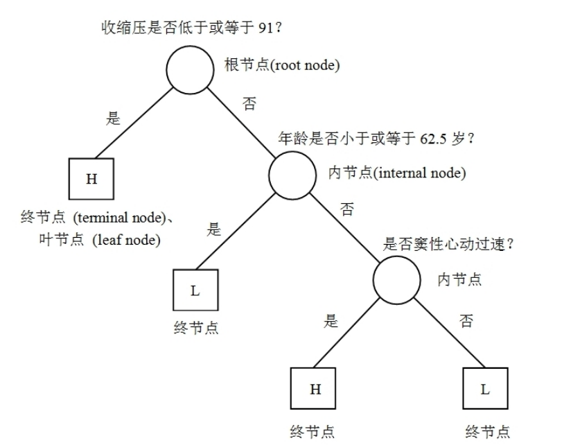

继承学习的思想是“三个臭皮匠，顶个诸葛亮”，但此结论有前提条件。如果这些臭皮匠的优缺点完全相同，则无论多少臭皮匠，也顶不过诸葛亮。

### 自适应提升法

最早的提升法为自适应提升法，仅适用于分类问题。

对于分类问题，考虑依次种 $M$ 棵树 $G_1(X),\dots ,G_M(X)$。

对于第 $m$ 棵树中错误分类的观测值，则在之后的第 $m+1$ 棵树中给予更大的权重，提升后续树对该错误分类观测值的关注度。

具体来说，可通过以下两种方法来加大错分观测值的权重：

1. **权重更新**：在定义基尼指数或信息熵的不纯度函数，以及在计算终节点的观测值时，均考虑不同观测值的权重。对于错分观测值，增加其权重。
2. **再抽样**：在种每棵决策树时，都使用从“加权的分布”中再抽样得到的数据。这需要先将每轮的权重标准化，使得权重之和为1.

这里来看一个例子：假设训练数据为 ${(x_1,y_1),(x_2,y_2),\dots,(x_n,y_n)}$，其中 $y_i \in \{0,1\}$ 表示样本的类别。其中 $y=1$ 表示正例，$y=0$ 表示反例。

AdaBoost算法可分为以下三步，而其中第二步又分为5小步。针对弱分类器 $m =1 ,\dots ,M$ 进行for循环：

1. **初始化权重**：令每个观测值的初始权重为 $w_i = \frac{1}{n}$，其中 $n$ 为观测值的总数。
2. 对于决策树 $m =1 ,\dots ,M$，进行以下操作：
   1. 使用观测值 $i$ 的当前权重 $w_i$，估计第 $m$ 棵决策树 $G_m(X)$
   2. 根据当前权重 $w_i$，并计算其在训练集上的错误率:

      $$
      \epsilon_m = \frac{\sum_{i=1}^n w_i \mathbb{I}(G_m(x_i) \neq y_i)}{\sum_{i=1}^n w_i}
      $$

      其中，分母为所有观测值的权重之和，而分子为错分观测值的权重之和。
   3. 计算正确分类的对数几率，即正确分类的概率 $1-\epsilon_m$ 除以错误分类的概率 $\epsilon_m$，得到：

      $$
      \alpha_m = \log\left(\frac{1-\epsilon_m}{\epsilon_m}\right)
      $$

   4. 更新观测值的权重：

      $$
      w_i \leftarrow w_i \cdot \exp[\alpha_m \cdot I(y_i \neq G_m(\mathbf{x}_i))]
      $$

   5. 将所有权重标准化，保证权重之和为1，即：

      $$
      w_i \leftarrow \frac{w_i}{\sum_{j=1}^n w_j}
      $$

3. 将每棵决策树的预测结果 $G_m(X)$，以对数几率 $\alpha_m$ 为权重，进行加权平均，得到最终的预测结果：

   $$
   G(\mathbf{x}) = \text{sign}\left[\sum_{m=1}^{M} \alpha_m G_m(\mathbf{x})\right]
   $$

   其中, $\text{sign}(\cdot)$为“符号函数” (sign function), 即

   $$
   \text{sign}(z) = \begin{cases}
   1 & \text{if } z \ge 0 \\
   -1 & \text{if } z < 0
   \end{cases}
   $$

   结果只有1和-1两种，对应两种 $y$ 的类别。下一个弱分类器的训练考虑上一次的权重，求出使得错分率最小的阈值函数，即 $G_{\{ \}}(X)$。

在AdaBoost算法的第2步中，进一步考察第4步观测值权重的变化：

**“弱分类器”(weak classifier)的错分率至少比随机猜测更低**，则几率
$\left(\frac{1 - err_m}{err_m}\right) > 1$，故对数几率 $\alpha_m = \ln\left(\frac{1 - err_m}{err_m}\right) > 0$。故权重更新公式可写为：

$$
w_i \leftarrow w_i \cdot \exp[\alpha_m \cdot I(y_i \neq G_m(\mathbf{x}_i))] =
\begin{cases}
w_i \cdot \left(\frac{1 - err_m}{err_m}\right) & \text{if } y_i \neq G_m(\mathbf{x}_i) \\
w_i & \text{if } y_i = G_m(\mathbf{x}_i)
\end{cases}
$$

分类错误的观测值权重增加 $\left(\frac{1 - err_m}{err_m}\right) > 1$ 倍，而分类正确的观测值权重不变。

为保持所有观测值的权重之和为1，分类正确的观测值权重相对地减小。

如果某观测值一直分类错误，则其权重将不断增加，表明算法越来越希
望能将此“顽固”或困难(hard)的观测值正确地分类。

由Adaboost的第三步：集成学习的最后结果**以加权多数票决定**，而权重为正确分类的对数几率 $\alpha_m = \ln\left(\frac{1 - err_m}{err_m}\right) > 0$

分类越正确的决策树，权重就越大。

现讲二分类问题的Adaboost算法推广到多分类问题：对于多分类问题，假设 $y \in \{1, 2, \dots, K\}$。

对分类问题的前两步算法与二分类问题基本相同，但最后进行加权多数投票的公式为

$$
G(\mathbf{x}) = \underset{y \in \{1, 2, \dots, K\}}{\operatorname{argmax}} \left[ \sum_{m=1}^{M} \alpha_m I(y = G_m(\mathbf{x})) \right]
$$

其中，给定特征向量 $X$，判断第 $m$ 棵树的预测结果 $G_m(X)$ 是否正确。然后再以正确分类的对数几率 $\alpha_m$ 作为权重，进行加权投票。

分别计算 $y = 1,2,\dots,K$ 所得票数，最后以得票最多的作为最后的预测结果。

AdaBoost 算法的作用机制需从偏差与方差的角度来考察。

一方面，由于每棵树均纠正上一棵树的错误，迫使分类器更加重视特征空间中错误分类的区域，故可降低偏差。

另一方面，由于AdaBoost 的最终预测结果为很多决策树的加权平均，也可达到降低方差的效果。

早期的AdaBoost算法通常使用树桩作为弱学习器，即只有一个根节点与两个终节点的决策树。

该决策树仅选择一个变量做一次分裂，一般为弱学习器。

由于树桩仅做一次分裂，故其偏差较大而方差较小，很难拟合。

但若使用树桩作为基学习器，则无法捕捉变量之间的“交互效应”(interaction effect，类似于线性回归的交互项)，故未必总能达到最好的预测效果。

AdaBoost 最基本的性质是它能在学习过程中不断减少训练误差，即在训练数据集上的分类误差率。

AdaBoost的训练误差界：

$$
\frac{1}{N} \sum_{i=1}^{N} I(G(x_i) \neq y_i) \leq \frac{1}{N} \sum_{i} \exp(-y_i f(x_i))
$$

### AdaBoost 算法的解释

可以认为AdaBoost 算法是模型为加法模型、损失函数为指数函数、学习算法为向前分布算法时的二类分类学习方法。

**向前分布算法：**

$$
f(x) = \sum_{m=1}^{M} \beta_m b(x; \gamma_m)
$$

其中, $b(x; \gamma_m)$ 为基函数, $\gamma_m$ 为基函数的参数, $\beta_m$ 为基函数的系数。显然, 上式是一个加法模型。

在给定训练数据及损失函数 $L(y,f(x))$ 的条件下，学习加法模型 $f(x)$ 成为损失函数极小化问题：

$$
\min_{\beta_m, \gamma_m} \sum_{i=1}^{N} L\left(y_i, \sum_{m=1}^{M} \beta_m b(x_i; \gamma_m)\right)
$$

通常这时一个非凸优化问题（变量太多，组合爆炸 。向前分布算法求解这一优化问题的想法是：因为学习的是加法模型，如果能够从前向后，每一步只学习一个基函数及其系数，逐步逼近目标函数式：也就是说：假设已学到第 $m-1$ 步的模型:

$$
f_{m-1}(x) = \sum_{k=1}^{m-1} \beta_k b(x; \gamma_k)
$$

第 $m$ 步的目标是找最优的 $\beta_m, \gamma_m$, 最小化损失:

$$
\min_{\beta,\gamma} \sum_{i=1}^{N} L(y_i, f_{m-1}(x_i) + \beta b(x_i; \gamma))
$$

等价于优化:

$$
\min_{\beta,\gamma} \sum_{i=1}^{N} L(y_i, \beta b(x_i; \gamma))
$$

(因 $f_{m-1}(x_i)$ 是“已知的前 $m-1$ 步结果”, 可视为常数, 不影响 $\beta, \gamma$ 的优化)，这样，前向分布算法将同时求解从 $m=1$ 到 $M$ 的所有参数 $\beta_m$，$\gamma_m$ 的优化问题简化为逐个求解各个 $\beta_m$ ，$\gamma_m$ 的优化问题。

**前向分布算法与AdaBoost**：AdaBoost 算法是前向分布算法的特例。这时，模型是由基本分类器组成的加法模型，损失函数是指数函数。推导如下：

前向分布算法学习的是加法模型，当基函数为基本分类器时，该加法模型等价于AdaBoost的最终分类器

$$
f(x) = \sum_{m=1}^{M} \alpha_m G_m(x)
$$

由基本分类器 $G_m(x)$ 及其系数 $\alpha_m$ 组成。前向分布算法逐一学习基函数，这一过程与AdaBoost算法逐一学习基本分类器的过程一致。

下面证明前向分布算法的损失函数时指数损失函数

$$
L(y, f(x)) = \exp[-y f(x)]
$$

时，其学习的具体操作等价于AdaBoost算法学习的具体操作。

假设已经经过了 $m-1$ 轮迭代前向分布算法，已经得到 $f_{m-1}(x)$：

$$
\begin{align*}
f_{m-1}(x) &= f_{m-2}(x) + \alpha_{m-1}G_{m-1}(x) \\
&= \alpha_1 G_1(x) + \dots + \alpha_{m-1}G_{m-1}(x)
\end{align*}
$$

在第 $m$ 轮迭代得到 $\alpha_m$，$G_m(x)$ 和 $f_m(x)$

$$
f_m(x) = f_{m-1}(x) + \alpha_m G_m(x)
$$

目标是使前向分布算法得到的 $\alpha_m$ 和 $G_m(x)$ 使 $f_m(x)$ 在训练数据集 $T$ 上的损失函数最小，即

$$
(\alpha_m, G_m(x)) = \arg\min_{\alpha, G} \sum_{i=1}^{N} \exp[-y_i(f_{m-1}(x_i) + \alpha G(x_i))]
$$

式子可以表示为：

$$
(\alpha_m, G_m(x)) = \arg\min_{\alpha, G} \sum_{i=1}^{N} \bar{w}_{mi} \exp[-y_i \alpha G(x_i)]
$$

其中, $\bar{w}_{mi} = \exp[-y_i f_{m-1}(x_i)]$。因为 $\bar{w}_{mi}$ 既不依赖 $\alpha$ 也不依赖于 $G$, 所以与最小化无关。但 $\bar{w}_{mi}$ 依赖于 $f_{m-1}(x)$, 随着每一轮迭代而发生改变。

现证使式上式达到最小的 $\alpha_m^*$ 和 $G_m^*(x)$ 就是 AdaBoost 算法所得到的 $\alpha_m$ 和 $G_m(x)$。求解可分两步:

1. 求 $G_(m)$
对固定 $\alpha > 0$, $\exp(-y_i \cdot \alpha \cdot G(x_i))$ 的值:

   - 若 $G(x_i) = y_i$ (分类正确), 则 $\exp(-y_i \cdot \alpha \cdot G(x_i)) = \exp(-\alpha)$;
   - 若 $G(x_i) \neq y_i$ (分类错误), 则 $\exp(-y_i \cdot \alpha \cdot G(x_i)) = \exp(\alpha)$。

   因此, 损失函数可改写为: $\sum_{i=1}^{N} \bar{w}_{mi} \cdot \exp(-y_i \cdot \alpha \cdot G(x_i)) = e^{-\alpha} \sum_{G(x_i)=y_i} \bar{w}_{mi} + e^{\alpha} \sum_{G(x_i) \neq y_i} \bar{w}_{mi}$

   为最小化该损失, 需让错误分类的样本权重和最小 (因 $e^{\alpha} > e^{-\alpha}$, 错误分类的损失更大)。因此, 最优基函数 $G_m^*(x)$ 是: $G_m^*(x) = \arg\min_G \sum_{i=1}^{N} \bar{w}_{mi} \cdot I(y_i \neq G(x_i))$

   这与 AdaBoost 中“用当前样本权重训练弱分类器”的逻辑完全一致

2. 将 $G_m^*(x)$ 代入损失函数, 可进一步简化为关于 $\alpha$ 的函数:

   $$
   \sum_{i=1}^{N} \bar{w}_{mi} \cdot \exp(-y_i \cdot \alpha \cdot G_m^*(x_i)) = e^{-\alpha} \sum_{\text{对分样本}} \bar{w}_{mi} + e^{\alpha} \sum_{\text{错分样本}} \bar{w}_{mi}
   $$

   对 $\alpha$ 求导并令导数为 0, 可解得最优系数: $\alpha_m = \frac{1}{2} \log\left(\frac{1-e_m}{e_m}\right)$

   其中 $e_m = \frac{\sum_{\text{错分样本}} \bar{w}_{mi}}{\sum_{i=1}^{N} \bar{w}_{mi}}$ 是加权错分率 (与 AdaBoost 中的 $err_m$ 一致)。

最后来看每一轮样本权值的更新。由

$$
f_m(x) = f_{m-1}(x) + \alpha_m G_m(x)
$$

以及 $\bar{w}_{mi} = \exp[-y_i f_{m-1}(x_i)]$, 可得

$$
\bar{w}_{m+1,i} = \bar{w}_{m,i} \exp[-y_i \alpha_m G_m(x)]
$$

### 提升树

以决策树为基函数的提升方法称为提升树。对分类问题决策树是二叉分类树，对回归问题决策树是二叉回归树。**提升树模型可以表示为决策树的加法模型：**

$$
f_M(x) = \sum_{m=1}^{M} T(x; \Theta_m)
$$

其中, $T(x; \Theta_m)$ 表示决策树, $\Theta_m$ 为决策树的参数, $M$ 为树的个数。

**提升树算法**：采用前向分布算法。首先确定初始提升树 $f_0(x) = 0$，第 $m$ 步的模型是

$$
f_m(x) = f_{m-1}(x) + T(x; \Theta_m)
$$

其中，$f_{m-1}(x)$ 为当前模型，通过风险函数极小化确定下一棵决策树的参数 $\Theta_m$

$$
\hat{\Theta}_m = \arg\min_{\Theta_m} \sum_{i=1}^N L\left(y_i, f_{m-1}(x_i) + T(x_i; \Theta_m)\right)
$$

由于树的线性组合可以很好的拟合训练数据，即使数据中的输入与输出之间的关系很复杂也是如此，所以提升树是一个高功能的学习算法。

对于不同问题的提升树学习算法，其主要区别在于损失函数的不同。包括使用平方误差损失的回归问题，用指数损失函数的分类问题，以及用一般损失函数的一般决策问题。

对于二分类问题，提升树算法只需要将 Adaboost算法中的基本分类器限制为二类分类树即可，可以说这时的提升树算法是 AdaBoost 算法的特殊情况。下面叙述回归问题的提升树。

